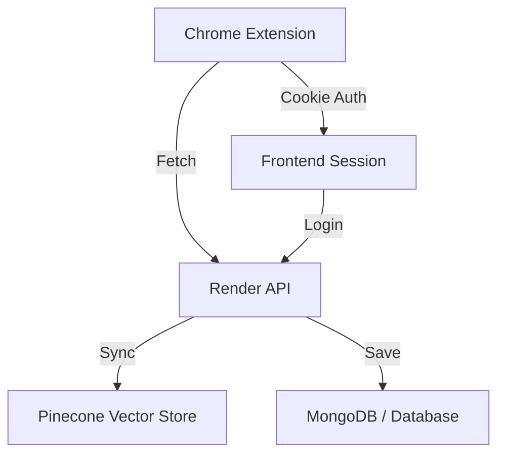

# 🧠 Second Brain Assistant

[](https://opensource.org/licenses/MIT)
[](https://github.com/)
[](https://developer.mozilla.org/en-US/docs/Web/JavaScript)
[](https://chrome.google.com/webstore)

> [!TIP]
> **Live Web App:** [https://ai-second-brain-stz4.onrender.com](https://ai-second-brain-stz4.onrender.com)
> 
> Redefine how you capture knowledge. The Second Brain Assistant lives in your browser, acting as a tactile bridge between the web and your digital library.

---

## 🌑 The Obsidian Intelligence Aesthetic

Designed for focus. Built for speed. The Second Brain Assistant features a premium, monochromatic interface that disappears when you don't need it and empowers you when you do.

- **Fluid Obsidian UI:** A strict 4px/8px grid system for perfect spatial harmony.
- **Micro-animations:** Staggered slide entrances and smooth cubic-bezier transitions.
- **Glassmorphism:** Layered surfaces with high-end `backdrop-filter` effects.

---

## 🚀 Core Functionalities

### ⚡ Instant Auto-Capture
Save the current tab in one click. The extension automatically extracts the page title, URL, description, and preview image using intelligent metadata scraping.

### 🔗 External Archive
Paste any URL (YouTube, Twitter, articles) directly into the extension to archive it to your library without opening the web app.

### 📁 Artifact Sync
Upload PDFs and Images (up to 50MB) directly from the popup. Ideal for research papers, receipts, and visual inspiration.

### 🔐 Secure Session Sync
Real-time connectivity with your [Render deployment](https://ai-second-brain-stz4.onrender.com). The extension automatically syncs with your web app's authentication cookie.

---

## 🛠️ Installation (Free / Developer Mode)

Since this extension is optimized for your private deployment, you can install it for free without the Chrome Web Store fee:

1. **Clone the Repository:**
   ```bash
   git clone https://github.com/fardeen-99/AI_SECOND_BRAIN.git
   ```

2. **Open Extensions Page:**
   Type `chrome://extensions/` in your Chrome browser.

3. **Enable Developer Mode:**
   Toggle the switch in the top-right corner.

4. **Load Unpacked:**
   Click the **"Load unpacked"** button and select the following folder:
   `Second-Brain-App/second-brain-extension/`

5. **Pin & Pin:**
   Pin the **Second Brain Assistant** to your toolbar for instant access.

---

## ⚙️ Configuration

The extension is pre-configured to communicate with:
- **Production API:** `https://ai-second-brain-stz4.onrender.com/api`
- **Dashboard:** `https://ai-second-brain-stz4.onrender.com/dashboard`

---

## 🏗️ Architecture



---

<div align="center">
  <p align="center">Built with 🖤 for the Second Brain Community</p>
  <p align="center"><i>"Your mind is for having ideas, not for holding them."</i> — David Allen</p>
</div>
