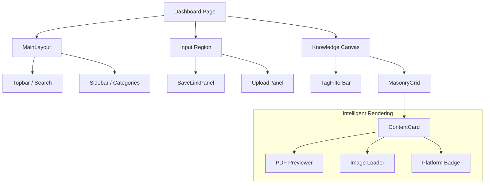

# 🎨 Second Brain Frontend: Premium UI & Knowledge Canvas Architecture

This document outlines the design philosophy and component architecture of the **Second Brain Frontend**, focusing on the latest **Glassmorphism** transformation and the **Intelligent Content Canvas**.

---

## 🏗️ UI Component Architecture

The frontend is built on a modular "Atomic" structure, ensuring high reusability and a consistent premium aesthetic.



---

## 🚀 Key UI Innovations

### 1. The "Knowledge Canvas" (Dashboard)
We've moved away from standard lists to a **dynamic Masonry Grid**.
*   **Reactive Layout**: Content cards of varying heights (PDFs, Images, Tweets) organize themselves optimally to maximize information density.
*   **Glassmorphism Effects**: Translucent cards with subtle backdrops, border-glows, and deep shadows create a "floating" feel.
*   **Micro-interactions**: Hover-scaled cards, smooth tag transitions, and button state animations using GSAP/Tailwind.

### 2. Intelligent Content Cards (`ContentCard.jsx`)
The heart of the curation experience. It automatically adapts its UI based on content type:
*   **PDF Intelligence**: Renders a "Secure Preview" of documents using embedded object views with toolbars disabled for a clean look.
*   **OCR Awareness**: Displays extracted text snippets for images and documents, making them searchable via the frontend filter.
*   **Media Proxying**: Automatically routes third-party images (LinkedIn/Twitter) through our backend proxy to bypass CORS/hotlink protections.
*   **Smart Branding**: Automatically detects the source (YouTube, Twitter, Instagram, LinkedIn) and applies the correct brand badge and favicon.

### 3. Integrated Search & Tagging
*   **Real-time Filtering**: The `useFilteredContent` hook provides instant feedback as you type or click tags.
*   **Dynamic Tag Cloud**: Tags are automatically harvested from the user's content and displayed in a horizontal-scrolling chip bar.

---

## 🎨 Design System: "Obsidian Amber"

Our curated color palette and styling choices define the "top 5%" feel of the application:

| Element | Style Strategy |
| :--- | :--- |
| **Backdrop** | Deep `#0c0c0c` with ambient radial gradients. |
| **Cards** | `GlassCard` component using `backdrop-blur-xl` and `bg-white/5`. |
| **Typography** | Inter/Outfit stack with high contrast for readability (`#fff1d5` headers). |
| **Accents** | Amber/Gold (`#f8ae1d`) for primary actions and loading states. |
| **Borders** | Subtle `1px` borders with `rgba` transparency to catch the light. |

---

## 📁 Frontend Component Tree

```text
second-brain-frontend/
├── src/
│   ├── components/
│   │   ├── layout/
│   │   │   ├── MainLayout.jsx       # Global structural container
│   │   │   └── Topbar.jsx           # Global search & profile
│   │   ├── content/
│   │   │   ├── MasonryGrid.jsx      # Adaptive layout engine
│   │   │   └── ContentCard.jsx      # The intelligent media renderer
│   │   ├── features/
│   │   │   ├── SaveLinkPanel.jsx    # URL archival interface
│   │   │   └── UploadPanel.jsx      # OCR/PDF upload interface
│   │   └── ui/
│   │       ├── GlassCard.jsx        # Pre-styled glassmorphic base
│   │       └── TagBadge.jsx         # Platform-specific branding chips
│   ├── hooks/
│   │   ├── useContent.js            # Unified data & filter logic
│   │   └── useAuth.js               # Secure session management
│   └── lib/
│       └── toast.js                 # Custom animated feedback system
```

---

## ⏩ Next Steps for UI Enhancement

- [ ] **Dark/Light Mode Sync**: Auto-adaptive styling based on system preferences.
- [ ] **Drag-and-Drop Curation**: Allow users to drag files directly onto the Knowledge Canvas.
- [ ] **Full-Screen Reader**: A dedicated distraction-free reading mode for extracted PDF/Image text.

---
> [!IMPORTANT]
> **Performance Note**: The Masonry layout is optimized to handle 100+ cards simultaneously using virtualized rendering strategies to keep performance at 60fps.
